github link: https://github.com/nydo-weng/bigBrain

## 项目展示

### 1. 登录页面
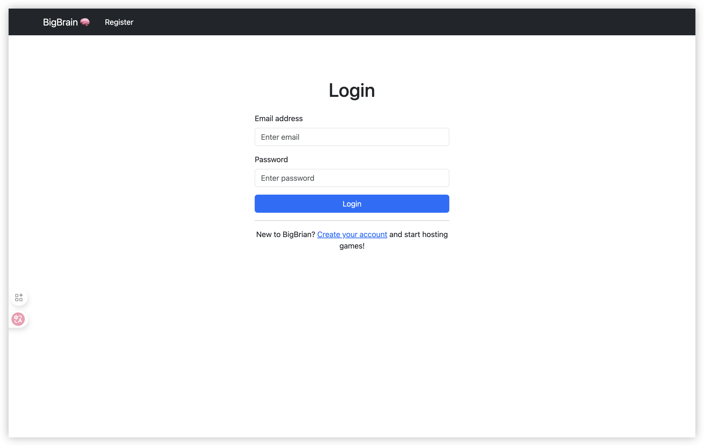

### 2. 注册页面
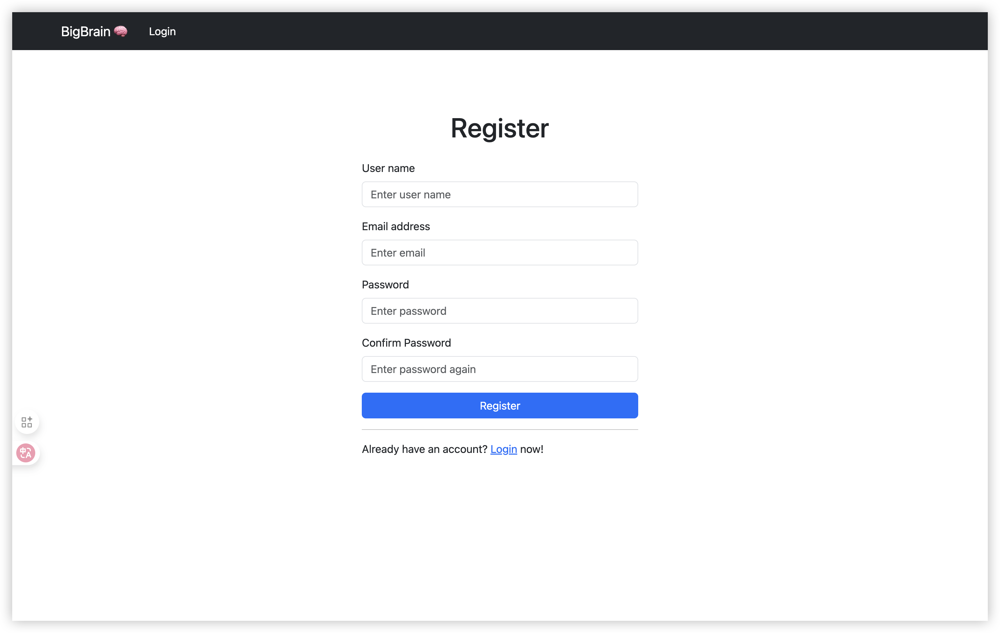

### 3. 仪表板
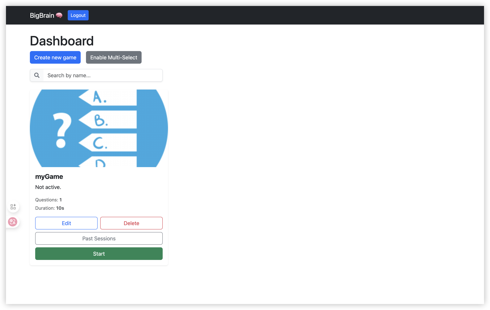

### 4. 游戏编辑
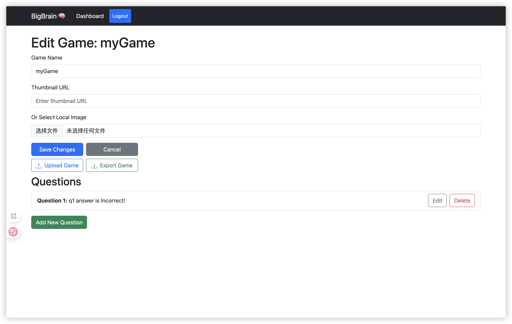

### 5. 问题编辑
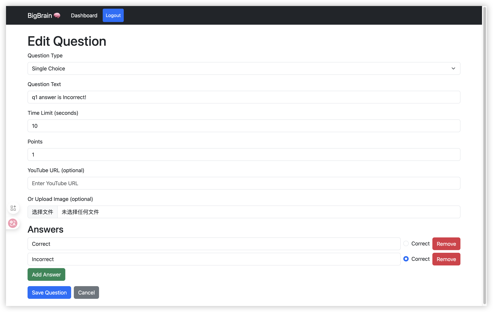

### 6. 主持会话
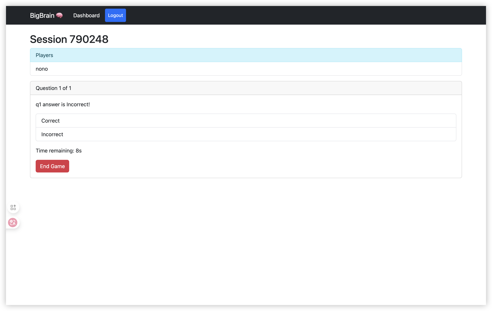

### 7. 会话开始前
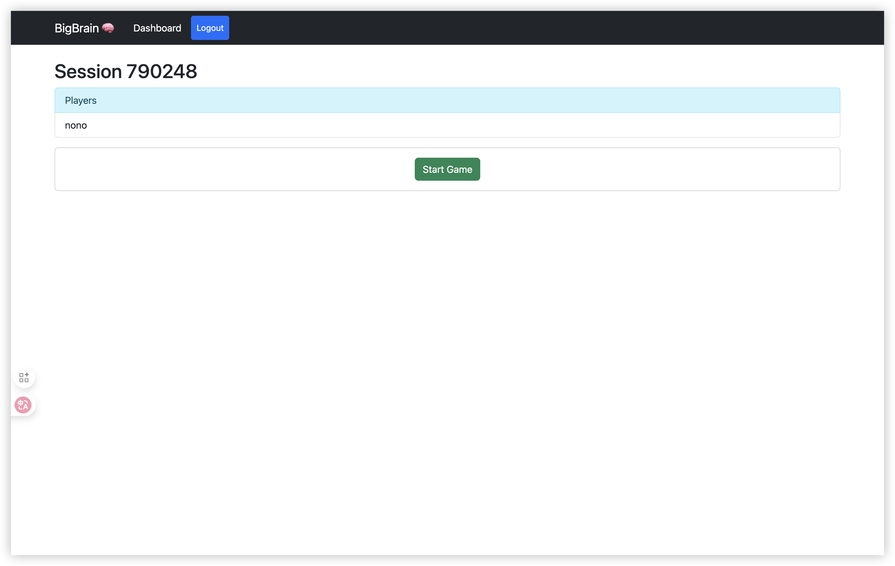

### 8. 等待房间
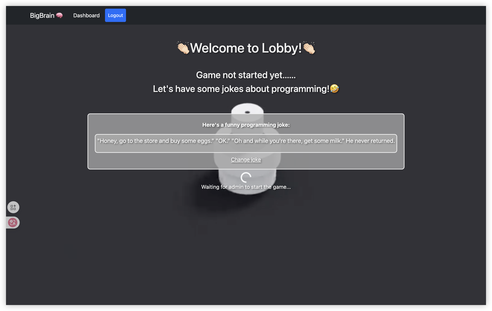

### 9. 会话开始
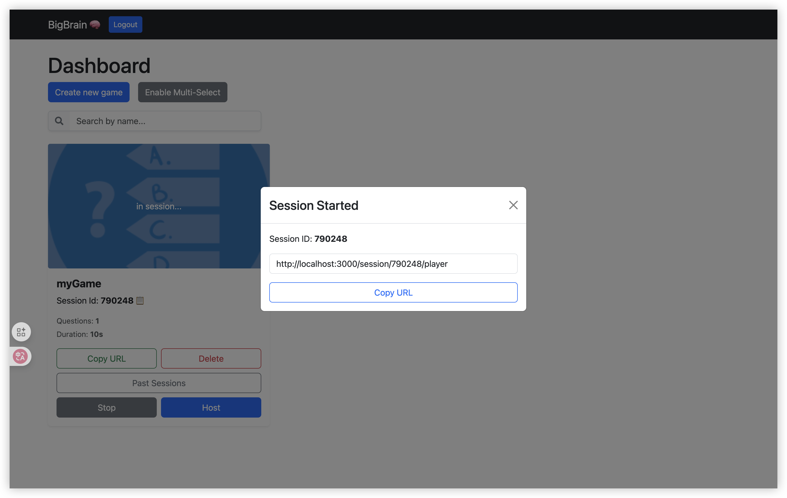

### 10. 玩家加入会话
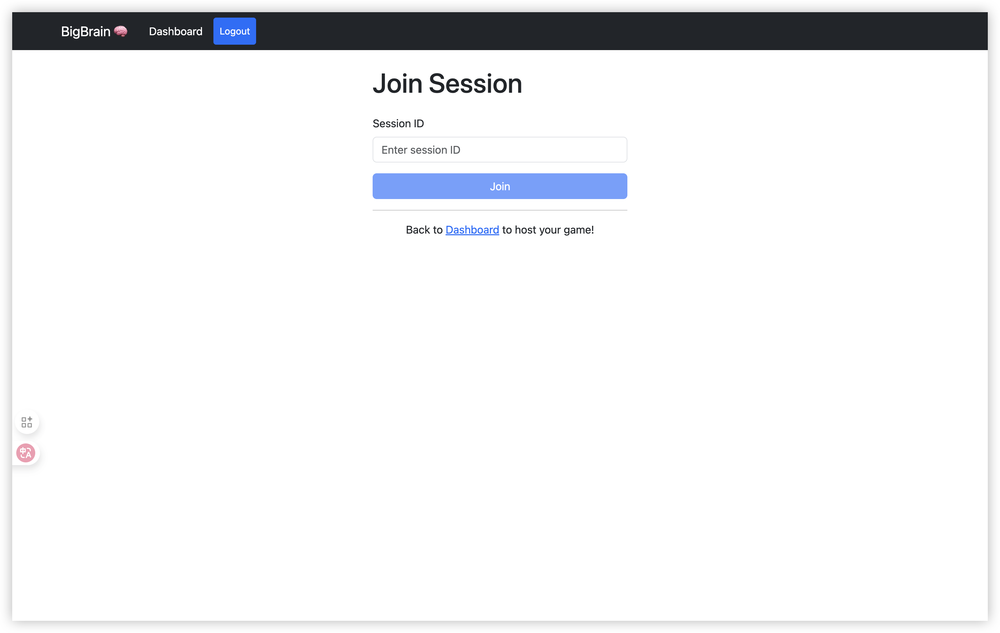

### 11. 玩家在会话中
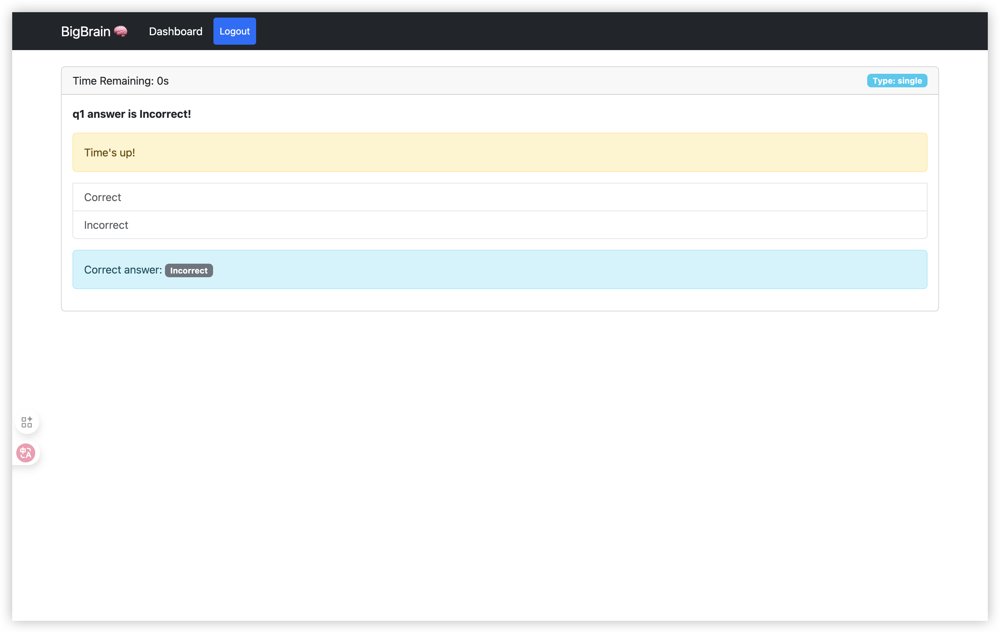

### 12. 会话结束
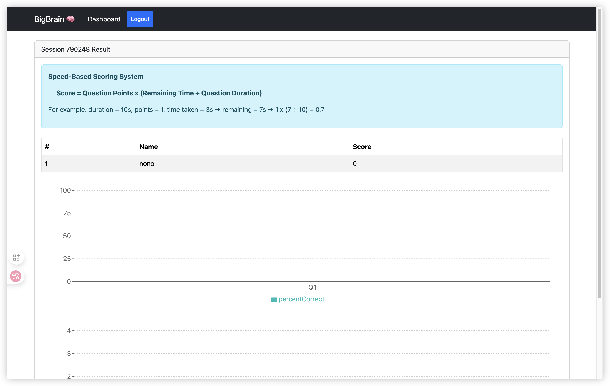

### 13. 玩家会话结束
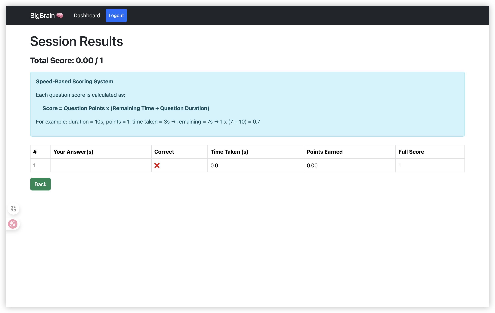

### 14. 历史会话结果
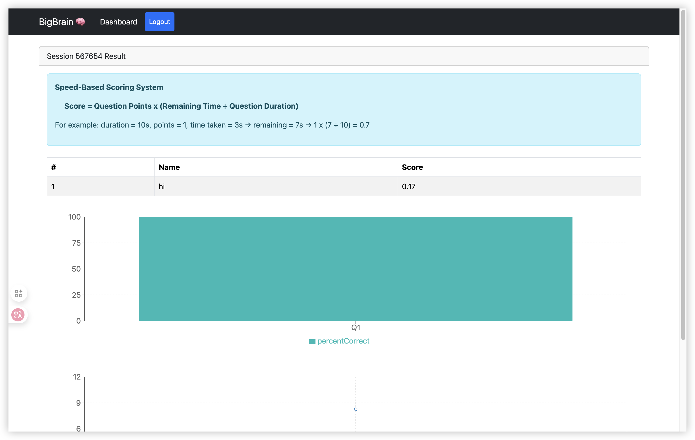