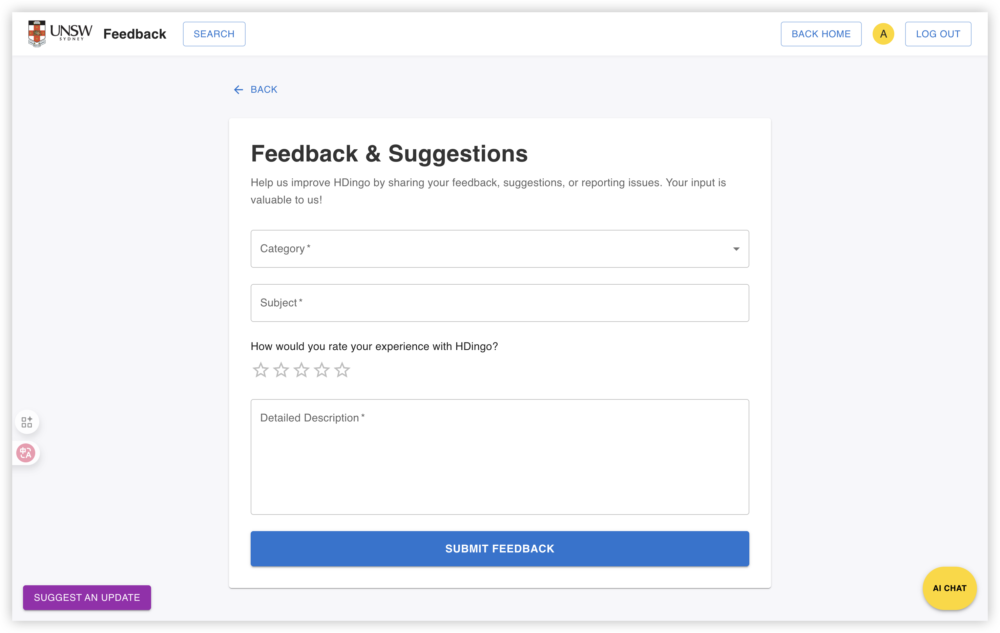

github link: https://github.com/nydo-weng/capstone-project-25t2--9900-f16a-cake

项目贡献记录：  

## 项目展示

### 1. 入口页面

### 2. 员工登录

### 3. 员工个人资料

### 4. 管理页面

### 5. 知识库上传

### 6. 建议表单

### 7. 人工工单

### 8. 工单回复

### 9. 工单上传

### 10. ChatGPT 风格 AI 聊天

### 11. 浮动 AI 聊天

